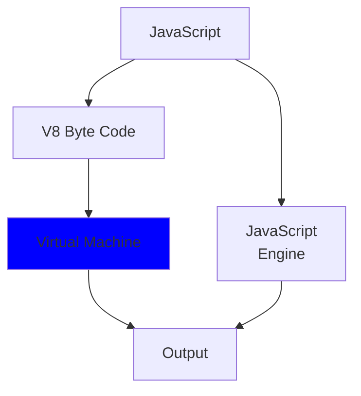

# V8 ByteCode Virtual Machine

An incomplete v8 bytecode interpreter / virtual machine for a subset of instructions. Plus, a tiny playground for profiling javascript code and inspecting the corresponding bytecode.

## Ambitions

This project's ambition is building an incomplete virtual machine capable of executing a subset of byte code supported by V8 JavaScript engine as pictured below.
Largely as a challenge of building a register machine capable of executing different operations, highly practical, as well as to better understand the inner-workings of the most popular and battle-tested JavaScript engine and optimizations happening behind the scenes.




## Running virtual machine

Note: Does not currently parse `.bytecode` files, the VM is currently work in progress

```bash
$ make start
```

|  |
|:-:|

## Running test suites

Install dependencies with `make install` and execute

```bash
$ make test # or make tdd
```

Running tests with high verbosity logs from executor

```bash
$ EXPLAIN=1 DEBUG=1 make test # or make tdd
```

## Generating bytecode

Generate `.bytecode` file for each javascript file in the `examples/` directory

```bash
$ make
```

Clean all `.bytecode` files in the `examples/` directory

```bash
$ make clean
```

## Interaction Example

```bash
$ make
✓ Generated examples/earlyReturn.bytecode
```

```bash
$ cat examples/earlyReturn.bytecode | head -20
[generated bytecode for function: main (0x26a884854fb9 <SharedFunctionInfo main>)]
Bytecode length: 49
Parameter count 2
Register count 3
Frame size 24
OSR nesting level: 0
Bytecode Age: 0
   71 S> 0x26a8848559ce @    0 : 0c                LdaZero
   77 E> 0x26a8848559cf @    1 : 6c 03 00          TestLessThan a0, [0]
         0x26a8848559d2 @    4 : 98 19             JumpIfFalse [25] (0x26a8848559eb @ 29)
   88 S> 0x26a8848559d4 @    6 : 21 00 01          LdaGlobal [0], [1]
         0x26a8848559d7 @    9 : c2                Star1
   96 E> 0x26a8848559d8 @   10 : 2d f9 01 03       LdaNamedProperty r1, [1], [3]
         0x26a8848559dc @   14 : c3                Star0
         0x26a8848559dd @   15 : 13 02             LdaConstant [2]
         0x26a8848559df @   17 : c1                Star2
   96 E> 0x26a8848559e0 @   18 : 5d fa f9 f8 05    CallProperty1 r0, r1, r2, [5]
  123 S> 0x26a8848559e5 @   23 : 0b 03             Ldar a0
  132 E> 0x26a8848559e7 @   25 : 46 ff 07          MulSmi [-1], [7]
  137 S> 0x26a8848559ea @   28 : a8                Return
```

```bash
$ make start
[DEBUG] OP [ 'Jump', [ 3 ] ]
[DEBUG] OP [ 'LdaZero' ]
[DEBUG] OP [ 'LdaGlobal', [ 0 ], [ 1 ] ]
[DEBUG] OP [ 'Star0' ]
[DEBUG] OP [ 'LdaNamedProperty', 'r0', [ 1 ], [ 3 ] ]
[DEBUG] OP [ 'Star1' ]
[DEBUG] OP [ 'LdaConstant', [ 2 ] ]
[DEBUG] OP [ 'Star2' ]
[DEBUG] OP [ 'CallProperty1', 'r1', 'r0', 'r2', [ 5 ] ]
•• Hello World ••
[DEBUG] OP [ 'LdaSmi', [ 6 ] ]
[DEBUG] OP [ 'Star0' ]
[DEBUG] OP [ 'TestLessThan', 'r0', [ 0 ] ]
[DEBUG] OP [ 'MulSmi', [ 5 ], [ 0 ] ]
[DEBUG] OP [ 'Return' ]
[DEBUG] ST {
  registers: {
    accumulator: 30,
    r0: 6,
    r1: [Function: log],
    r2: '•• Hello World ••',
    a0: undefined,
    a1: undefined,
    a2: undefined
  },
  flags: { boolean: false },
  constants: [ 'console', 'log', '•• Hello World ••', 1 ],
  ip: 14,
  return: 30
}
```

## Resources

- V8 / Interpreter / Ignition: [Design Doc](https://docs.google.com/document/d/11T2CRex9hXxoJwbYqVQ32yIPMh0uouUZLdyrtmMoL44/edit)
- V8 / Interpreter / ByteCodes: [Chromium](https://source.chromium.org/chromium/chromium/src/+/main:v8/src/interpreter/bytecodes.h;drc=main), [Node](https://github.com/nodejs/node/blob/master/deps/v8/src/interpreter/bytecodes.h)
